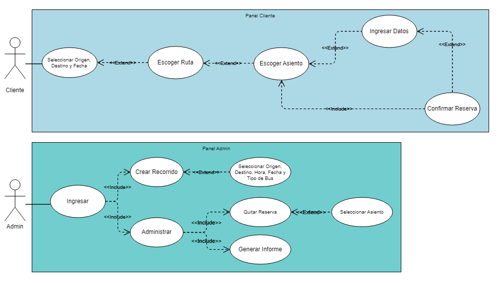

<h1 align="center">Proyecto: Programación orientada a objetos</h1>

<h3 align="center">Grupo Numero 3</h3>

<h3 align="left"> Autores</h3>

- **Rodrigo Bascuñán León**

- **Tomás Gutiérrez Bizama**

- **Martín Fuentealba Bizama**

### Enunciado del Tema
Descripción breve del tema o problema que aborda el proyecto.

### Diagrama UML
FOTITO
Descripción breve del diagrama UML.

### Diagrama de Casos de Uso

Explicación de cómo estos casos de uso se integran en el proyecto.

### Lista y Justificación de los Patrones Utilizados
- **Factory**: Se crean las Rutas para List<|Ruta|>, estas dentro de la clase RutaFactory, la cual requiere una ubicación de origen, otra para el destino y además una fecha junto a la hora de partida. Dependiendo de la distancia viajada (no está explicitamente la distancia) un viaje variará en su coste.
También se necesita de una parte importante que es el tipo de bus utilizado los cuales varían principalmente en el tamaño, aunque el bus mas grande incluye otro tipo de asientos extras junto a una diferencia de precios en estos.
- **Singleton**: Base de Datos actua de forma global para las demás clases que acceden a ella, de esta forma todas manejan los mismos datos y se actualizan en base a esta.

### Captura de Pantalla de la Interfaz
FOTITO
Descripción breve de la interfaz.

### Decisiones de Desarrollo

Miau

### Problemas de Desarrollo

Problemas

<h3 align="left">Lenguaje y herramientas</h3>

 <a href="https://www.java.com" target="_blank" rel="noreferrer">  <a href="https://git-scm.com/" target="_blank" rel="noreferrer">   

