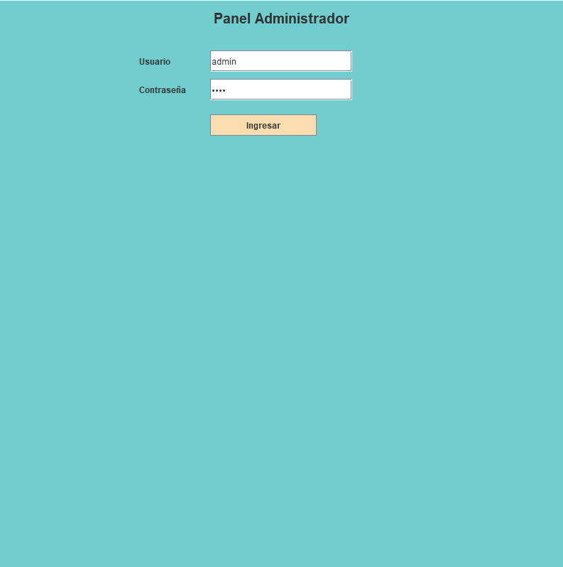

<h1 align="center">Proyecto: Programación orientada a objetos</h1>

<h3 align="center">Grupo Numero 3</h3>

<h3 align="left"> Autores</h3>

- **Rodrigo Bascuñán León**

- **Tomás Gutiérrez Bizama**

- **Martín Fuentealba Bizama**

### Enunciado del Tema
Tenemos una aplicación con la capacidad de reservar pasajes para viajar en distintos tipos de buses en rutas predefinidas, el programa inicia con 3 rutas.
Para usar el apartado de administración se requiere colocar el usuario "admin" y contraseña "1234", luego habrá 2 opciones:
**Crear recorrido** Esta opción sirve para añadir más rutas (además de las 3 que ya existen), la forma de usarlo es elegir la hora de salida, luego un lugar de origen y uno de destino los cuales deben ser distintos, se selecciona una fecha y el tipo de bus requerido, finalmente queda presionar "Crear Recorrido" (Se asumirá que buses con mismo origen, destino y hora son el mismo).
**Administración** Acá se podrán revisar los recorridos (rutas) ya existentes según su fecha y recorrido además de poder eliminar reservas de asientos. Lo primero es presionar "Ver recorridos" luego saldrá una lista con las rutas disponibles de la cual habrá que seleccionar una. 
Con "Ver informe ruta" se generara un documento dentro de la carpeta Proyecto/informeruta, esta contendrá la información general de la ruta (fecha, hora tipo de bus, tipos de asientos y su disponibilidad).
Con "Quitar reserva asiento" se podrá eliminar un asiento que haya sido reservado con anterioridad en dicha ruta seleccionada.
Luego tenemos el apartado del cliente
**Panel Cliente** se muestran los lugares de origen y de destino para poder seleccionar una ruta, estos a su vez mostraran los precios de los asientos en función de esta.
Para usarla se selecciona un origen en "¿Desde donde viajas?" y un destino en "¿Hacia donde vas?", estos deben ser distintos entre si, luego se selecciona una fecha en el calendario y finalmente se presiona "Revisar Itenerario".
Aparecerá una lista con los buses disponibles en cada horario considerando la ruta y fecha seleccionada, se elige la ruta que mas acomode, luego se selecciona un asiento no reservado y se procede con los datos. Es importante destacar que tanto el Nombre como el Apellido deben ser solo letras, el N° Tarjeta debe contener 16 dígitos, la Caducidad debe estar en formato MM/YY, el CVV debe tener 3 dígitos, el RUT debe ser uno real puesto que verifica con último dígito y el email debe contener el @. Luego de rellenar todos los datos se procede con la compra en "Confirmar Reserva".

### Diagrama UML

### Diagrama de Casos de Uso

### Lista y Justificación de los Patrones Utilizados
- **Factory**: Se crean las Rutas para List<|Ruta|>, estas dentro de la clase RutaFactory, la cual requiere una ubicación de origen, otra para el destino y además una fecha junto a la hora de partida. Dependiendo de la distancia viajada (no está explicitamente la distancia) un viaje variará en su coste.
También se necesita de una parte importante que es el tipo de bus utilizado los cuales varían principalmente en el tamaño, aunque el bus mas grande incluye otro tipo de asientos extras junto a una diferencia de precios en estos.
######
- **Singleton**: Base de Datos actua de forma global para las demás clases que acceden a ella, de esta forma todas manejan los mismos datos y se actualizan en base a esta.
######
- **Prototype**: Se crea la clase bus junto a todos sus párametros, esta implementa el método clonar, de esta forma se crea un nuevo objeto el cual puede copiar de forma muy similar al original, en este caso serían los distintos tipos de buses que se utilizan, luego cada bus se le agrega una propiedad distinta que hace diferenciar sus asientos.

### Captura de Pantalla de la Interfaz

Las primeras 4 imágenes son de la vista en orden del cliente, y las últimas 4 son la vista del administrador.

### Decisiones de Desarrollo

Las principales decisiones que tuvimos que tomar fueron al inicio del proyecto para ponernos de acuerdo como lo íbamos a hacer, primeramente nos queríamos hacer una idea general de la funcionalidad, así que desde un inicio teníamos claro el uso del panel cliente y panel admin, luego acordamos usar el patrón factory para la creación de rutas, de esta manera nos sería más fácil manejarlas para todos. Tuvimos un momento en el no sabíamos que más agregar al panel admin, pero con una lluvia de ideas al final decidimos agregar la opción de eliminar los asientos reservados en caso de ser necesario.

### Problemas de Desarrollo

Las mayores dificultades que tuvimos fueron precisamente con la toma de decisiones, ya que ponernos de acuerdo en un inicio fue algo complicado, sin embargo discutiendo durante un rato logramos sacar algo de todas las ideas para comenzar, a nivel de código tuvimos problemas al colocar los precios a las rutas, puesto que estas estaban mal elaboradas en un inicio y hubo que ajustar el como se creaban estas para poder colocar los precios adecuadamente, algo que nos costó igualmente fue el como colocar los asientos, simplemente no podíamos hacerlo para que quedaran de forma ordenada y a la vez funcionara la reserva. Y una de las últimas dificultades fue que en el panel admin ocurrieron unos cuantos errores como que los botones que se utilizan estaban intercambiados, hacían funciones que no debían o directamente no funcionaban, lo solucionamos en una ocasión que decidimos juntarnos para arreglar todos esos detalles.

<h3 align="left">Lenguaje y herramientas</h3>

 <a href="https://www.java.com" target="_blank" rel="noreferrer">  <a href="https://git-scm.com/" target="_blank" rel="noreferrer">   

